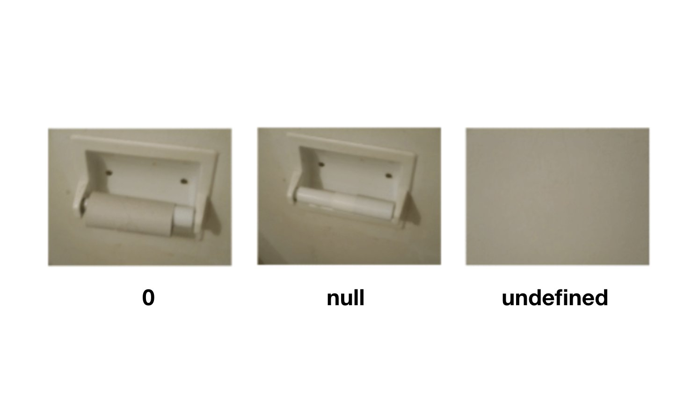

# JavaScript

Nos permite crear y añadir dinámica a nuestras aplicaciones web.

Para añadirlo utilizamos la etiqueta `script`:

```javascript
<script src="character.js"></script>
<script src="game.js"></script>
```

## 1. Variables

Son contenedores que nos permiten almacenar datos. No están asociadas directamente a un tipo de valor en particular

```javascript
let foo = 42; // foo es un número
foo = 'bar'; // foo ahora es un string
foo = true; // foo ahora es un booleano
```

## 2. Tipos de datos

Dado el tipo de dato que tenga una variable, podemos hacer uso de métodos (aunque en la teoría nos digan que los primitivos no tienen métodos) y propiedades

Si quiero sabe el tipo de dato que tiene mi variable utilizo `typeof variable` o `typeof(variable)`

```javascript
let foo = true;
typeof foo; // 'boolean'

typeof variableNoDeclarada; // 'undefined'
```

### 2.1 Primitivos

### 2.1.1 Strings

Secuencia de carácteres usado para representar un texto, puedes usar comillas simples (''), comillas dobles (""), o backticks (``)

```javascript
const nombre = 'Ana';
const apellido = 'Sosa';
```

### 2.1.2 Números

Usado para representar o manipular números: `3` ó `-3` ó `3.7` ó `Infinity`

### 2.1.3 Booleanos

Solo puede tener como valor `true` o `false`

```javascript
const esMayorDeEdad = true;
```

### 2.1.4 Undefined

Cuando declaro una variable y no le asigno un valor y deseo llamar a la variable el resultado será `undefined`

```javascript
let a;
var b;
console.log('El valor de a es:', a); // El valor de a es: undefined
console.log('El valor de b es:', b); // El valor de b es: undefined
```

### 2.1.5 Null

Sirve para determinar la ausencia de valor



### 2.1.6 Symbol

Lo usamos para crear valores irrepetibles, incluso al hacer la comparación obtendremos false como resultado ya que no son iguales

```javascript
Symbol() === Symbol(); // false
Symbol(11) === Symbol(11); // false
```

### 2.1.7 BigInit

Nos permite asignar un número entero en formato de precisión arbitraria, se le debe poner un n al final para indidicar que es un BigInit, las operaciones aritmeticas solo es posible hacerlas si los dos tipos de datos son BigInit.

```javascript
const numero1 = 567892342n;
const numero2 = BigInt(11);
```

---

> Todos los primitivos son inmutables, es decir, no se pueden modificar.

## 2.2 No Primitivos (mutables)

### 2.2.1 Objetos

Es un contenedor de propiedades, cada propiedad tiene un nombre y un valor.

### 2.2.2 Arrays

Son una colección de datos.

Algunas operaciones que le podemos realizar a nuestros arrays

```javascript
[1, 2, 3].map(n => n * 2);

['🍓', '🥑', '🥩'].filter(food => food !== '🥩');

['🐥', '🐯', '🐔', '🐷'].find(animal => animal === '🐔');

['🐥', '🐯', '🐔', '🐷'].findIndex(animal => animal === '🐔');

Array(3).fill('💸');

['✅', '✅', '❌', '✅', '✅'].every(element => element === '✅');

['✅', '✅', '❌', '✅', '✅'].some(element => element === '❌');

[
  {
    name: 'Dev 1',
    years: 3,
  },
  {
    name: 'Dev 2',
    years: 5,
  },
].reduce((accumulator, dev) => accumulator + dev.years, 0);

const users = [
  { nombre: 'ana', edad: 25 },
  { nombre: 'Pedro', edad: 26 },
];
const findAna = user => user.nombre === 'ana';
const user = users.find(findAna);
console.log('Edad de Ana:', user.edad);
```

### 2.2.2 Función

Es un fragmento de código que puede ser llamado por otro código o por sí misma (recursividad)

```javascript
(function () {}); // función anónima
() => {}; // función flecha

const saludar = function () {}; // declaration
const saludar2 = () => {}; // declaration
function despedirse() {} // expression

typeof saludar; // 'function'
typeof saludar2; // 'function'
typeof despedirse; // 'function'
typeof (() => {}); // 'function'
```
